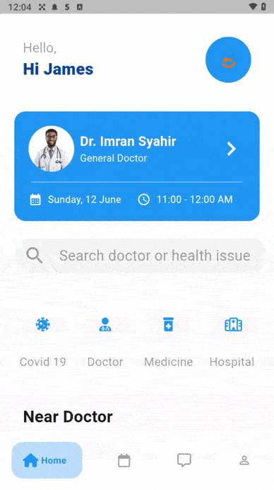
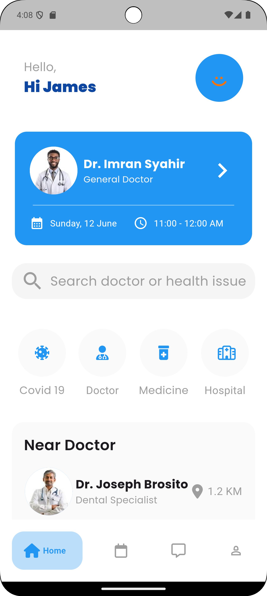
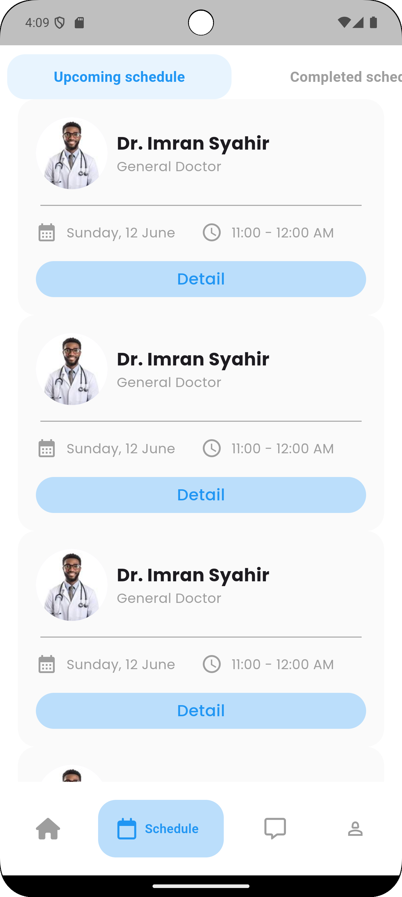

# Doctor Appointment UI

This project is a frontend implementation of a doctor appointment user interface. The design was
provided, and this repository focuses solely on bringing the given UI to life. The project does not
include backend functionality and is meant to showcase the layout and design features for a doctor
appointment system.

## Project Features:

- User-friendly appointment scheduling interface
- Intuitive navigation and clean design
- Responsive layout for different devices

## Figma Design

The original UI design was created using Figma. You can view the
design [here](https://www.figma.com/design/DnopTYPYmZniIrHBuu2r3J/Dokterian---Doctor-Appointment-Mobile-App-(Community)?node-id=3-588&node-type=frame&t=7q1ES5OIvRGPptGE-0).

## Demo

  <!-- GIF -->
  

  <!-- Screenshot 1 -->
  

  <!-- Screenshot 2 -->
  

---

Feel free to explore and modify the UI as needed!
